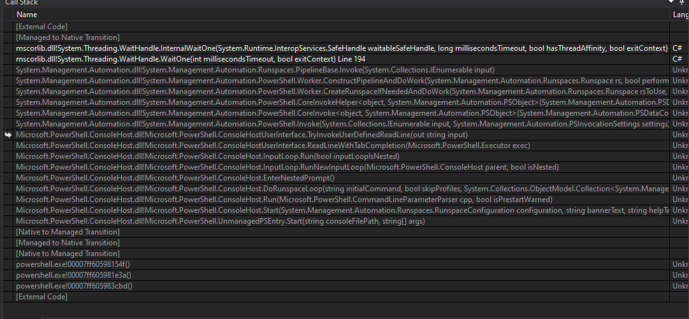
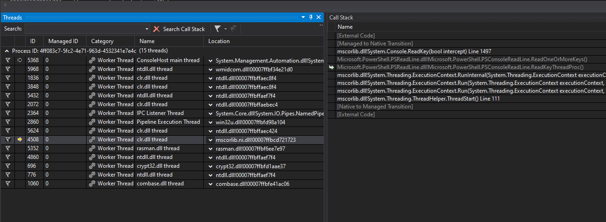
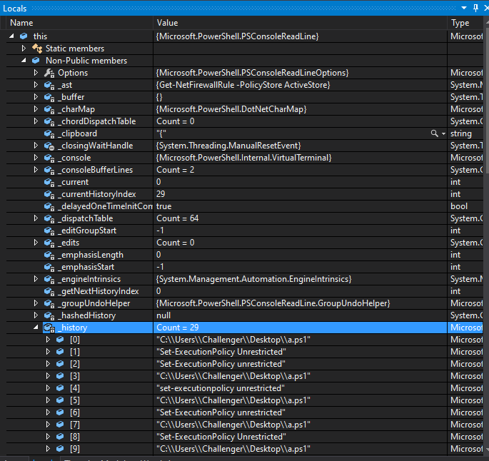

# Powershell Memory Reconstruction

## Credits
I did not solve this challenge, all credits go to @nulano and their solve [Here](https://gist.github.com/nulano/10b129d11f8e8bd6a4ff433d81aee1bd) which has been dumped on this readme.

## Description
How many unique commands were executed by the user in powershell.DMP?
Enter the answer as an integer, e.g. 99.

### Hints
<details>
<summary>Hint 1</summary>
dust of the debugger!
</details>

## Solve

Double-clicking the `powershell.DMP` file opened it in Visual Studio for me, I selected the Mixed debugger (native and managed code).
Looking at the stack trace of the main thread, it is clear that it is waiting for user input using a user-defined function: 


Looking up PowerShell on GitHub (or looking through the local variables), you can see that it called the PSConsoleHostReadLine function:
https://github.com/PowerShell/PowerShell/blob/e2c23fc5bd035251bed71413ad7c467c99dafd76/src/Microsoft.PowerShell.ConsoleHost/host/msh/ConsoleHostUserInterface.cs#L2179
```cs
        private const string CustomReadlineCommand = "PSConsoleHostReadLine";
```

If you are lucky with your GitHub search you can find this is typically implemented by a PowerShell module called PSReadLine:
https://github.com/PowerShell/PSReadLine/blob/master/PSReadLine/PSReadLine.psm1
```powershell
function PSConsoleHostReadLine
{
    ## Get the execution status of the last accepted user input.
    ## This needs to be done as the first thing because any script run will flush $?.
    $lastRunStatus = $?
    Microsoft.PowerShell.Core\Set-StrictMode -Off
    [Microsoft.PowerShell.PSConsoleReadLine]::ReadLine($host.Runspace, $ExecutionContext, $lastRunStatus)
}
```

This module stores user command history in a field called `_history`:
https://github.com/PowerShell/PSReadLine/blob/dc38b451bee4bdf07f7200026be02516807faa09/PSReadLine/History.cs#L92
```cs
namespace Microsoft.PowerShell
{
    // ...
    public partial class PSConsoleReadLine
    {
    // ...
        private HistoryQueue<HistoryItem> _history;
```

You can find it in the dump by switching to another thread (try all until you find it in the call stack).
If you then select a stack frame in PSReadFile, you can see the `_history` field in the Locals view:



The full list is:
```
"C:\\Users\\Challenger\\Desktop\\a.ps1"
"Set-ExecutionPolicy Unrestricted"
"Set-ExecutionPolicy unrestricted"
"C:\\Users\\Challenger\\Desktop\\a.ps1"
"set-executionpolicy unrestricted"
"C:\\Users\\Challenger\\Desktop\\a.ps1"
"Set-ExecutionPolicy unrestricted"
"C:\\Users\\Challenger\\Desktop\\a.ps1"
"Set-ExecutionPolicy Unrestricted"
"C:\\Users\\Challenger\\Desktop\\a.ps1"
"Set-ExecutionPolicy unrestricted"
"whoami"
"C:\\Users\\Challenger\\Desktop\\a.ps1"
"whoami"
"Get-Process"
"echo \"hahahahahahahaha\""
"Write-Host \"hohohohohohoho\""
"write-host \"to powershell we go\""
"whoami"
"Get-Process"
"dir env:"
"C:\\Users\\Challenger\\Desktop\\a.ps1"
"Get-ChildItem .\\"
"Get-LocalGroupMember"
"\nGet-Content C:\\Users\\Challenger\\database.db"
"echo \"keep going\""
"Write-Host \"okay done now... maybe\""
"Write-Host \"MAYBE NOT!\""
"Get-NetFirewallRule -PolicyStore ActiveStore"
```

The hardest part is, of course, figuring out what the challenge means by "unique commands".
You are supposed to ignore command parameters as well as upper/lower case to get the flag "11" without the FLAG{} marker.

Then reflect on how long it would have taken you to brute-force the number 11 compared to actually solving the challenge...

## Flag
```
FLAG{11}
```
