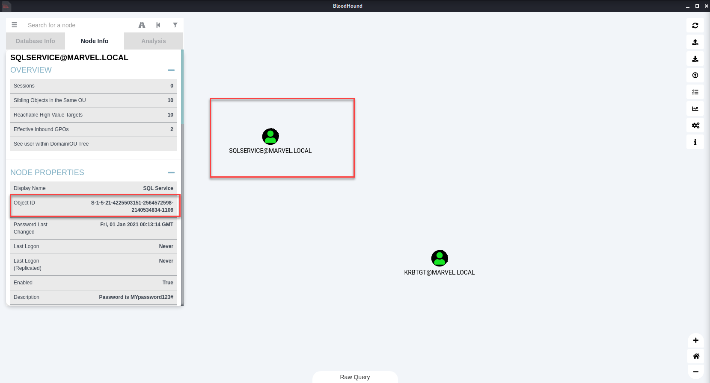

# Shortest Straw

## Descrption
What is the object id of the kerberoastable user that has the shortest path to the domain admins?

The flag will be in the format flag{object-id}

## Solve
- Start neo4j 
- Start bloodhound
- Load the zip file into bloodhound
- Use the function to get users with shortest path to privileges accounts
- Copy the SID of the user and use as the flag



## Flag
```
flag{S-1-5-21-4225503151-2564572598-2140534834-1106}
```
